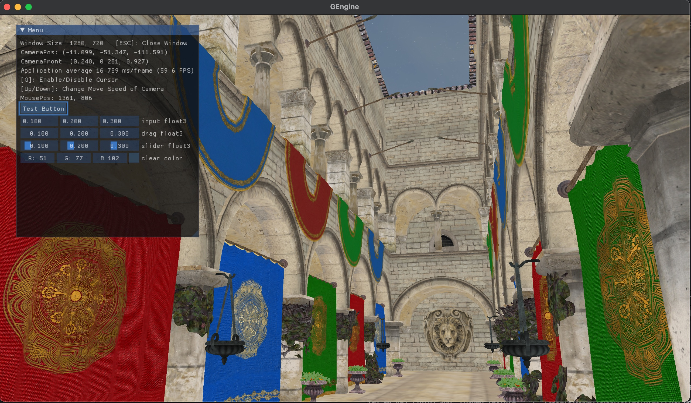
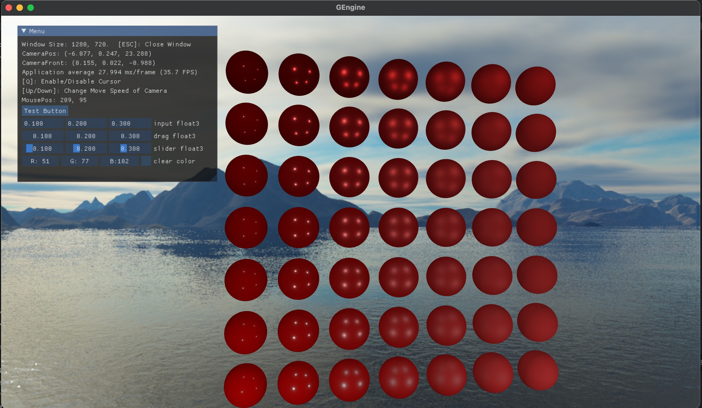

# myRenderer

A toy renderer

## Build for MACOS

`sudo chmod 777 ./build-macos.sh`

`sudo ./build-macos.sh`

The `.xcodeproj` file will be written to `build/`

## Feature

* Model Loading

* PBR 

## Files

* GEngine
* Sandbox
* shaders
* assets
* vendor

## Todo
