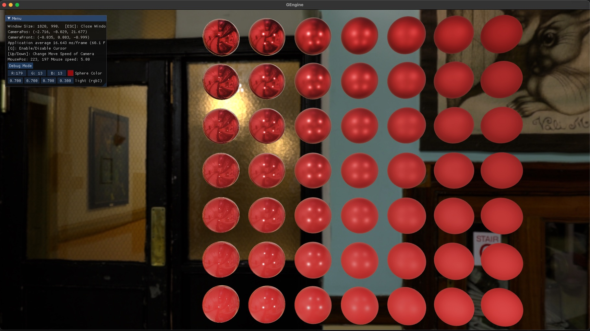
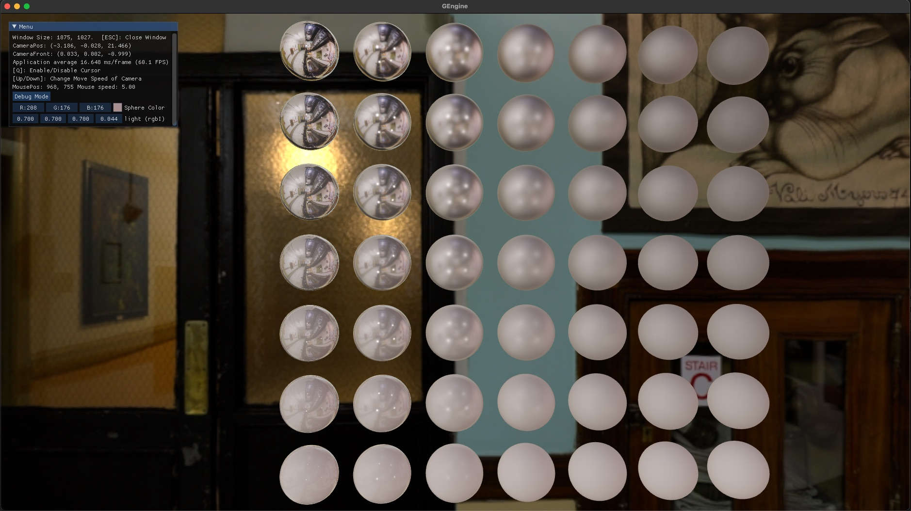
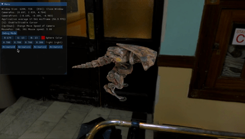
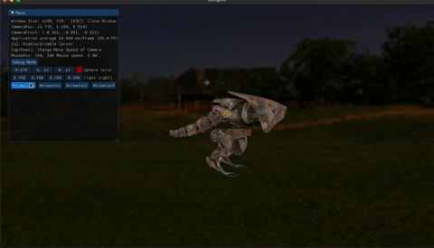

# myRenderer

A toy renderer

## Build for MACOS

`sudo ./build-macos.sh`

The `.xcodeproj` file will be written to `build/`

## Feature

* obj Model (`assets/model/sponza/sponza.obj`)

* PBR (MR) with Image Based Lighting

* glTF PBR Model `(assets/model/sponza-gltf-pbr/sponza.gltf)`

 

* glTF PBR Model-Debug  `(assets/model/sponza-gltf-pbr/sponza.gltf)`

* Skeletal Animation

* Animation Blending

## Files

* GEngine
* Sandbox
* shaders
* assets
* vendor

## Todo
